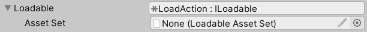
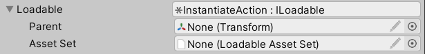
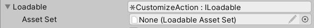
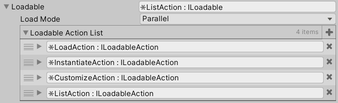
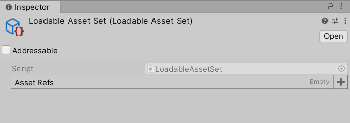
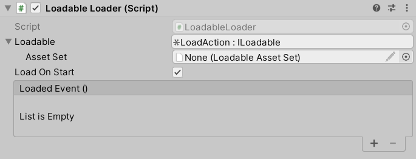

# Loadable Loader V1.0

> Dependency: Unity 2020.3; Odin - Inspector and Serializer 3.0

## Introduction

When entering a game scene or loading a complex game object, one common problem that you will meet is some assets should be loaded and initialized at the very beginning of the life cycle of the scene or the game object, but other assets on which they depend are not ready at that time. This will result in fatal null reference errors.

*LoadableLoader* is here to help. *LoadableLoader* is an asset loading manager by which you can surveillant and control the loading progress of the assets, avoiding any problems that cause by Unity Engine's messy loading sequence. You will absolutely need this! 


## Features
- Support loading progress surveillence and control.
- Support four types of loading strategies, which satisfy most of user demands.


## Instructions
*LoadableLoader* already provides a comprehensive encapsulation for all its functionalities, which can be used directly in the inspector of Unity editor. Before showing the detailed steps of using *LoadableLoader*, there is an introduction of the `ILoadable` interface and four asset loading actions.

+ ### ILoadable Interface
  `ILoadable` is interface that specifies the program logic of both *LoadableLoader* and its four asset loading actions. The interface specifies four behaviours: `Load()`, `IsLoaded()`, `ResetAndRelease()` ,and `GetLoadProgress()`. Please refer to source code below for more details:

  ```csharp
  public interface ILoadable
  {
      /// <summary>
      /// Begin to load assets, can be called multiple times. The callback will be executed when the 
      /// loading is finished.
      /// </summary>
      void Load(Action callback = null);

      /// <summary>
      /// Is all assets are loaded.
      /// </summary>
      bool IsLoaded();

      /// <summary>
      /// Release all loaded assets and reset loading status. Noted that assets will only be released
      /// when all of them are loaded. If user try to reset and relase during loading, the function
      /// wait until the loading is finished.
      /// </summary>
      void ResetAndRelease();

      /// <summary>
      /// Get current loading progress.
      /// </summary>
      float GetLoadProgress();
  }
  ```

+ ### Asset Loading Actions
  + #### I. Load Action:
    This action will load all assets into memory. To manage the status of assets, a `List<AsyncOperationHandle<Object>>` is defined to store the handles of all on-loading assets. You can manage the assets via their handles.
    

  + #### II. Instantiate Action:
    This action is an extended version of *load action*. It will load all assets into memory first, and then instantiate them at once. By doing so, we can guarantee all assets are instantiated in the same frame. Besides `List<AsyncOperationHandle<Object>>`, there is a `List<GameObject>` for your to directly access and manage the instantiated assets. By default, all assets will be instantiated in the root hierarchy of the scene, but you can also indicate the parent under which all assets are going to instantiate by assigning the *Parent* parameter. Noted that this action can only be used on `GameObject` assets.
    

  + #### III. Customize Action:
    This action is for users to customize their own asset loading strategies. You can customize your strategies by defining a new class which inherit from this action and overriding the `ILoadable` interface.
    

  + #### IV. List Action:
    This action is essentially a list of actions, which can contain *load action*, *instantiate action*, *custom action*, and *list action* as well. If you need to take more than one action in one load call, you can declare a list action and assign all actions you want to take to the *Loadable Action List*. There are two load modes for the list action: parallel and sequential. The sequential load mode ensures each action will only start to load when its previous action finishes loading, while in parallel mode all action will load at the same time.
    

+ ### General Steps
  Following are the detail steps of how to use *LoadableLoader*
  + #### I. Prepare Asset Set:
    First and foremost, you need to create a *LoadableAssetSet* and assign the assets you want to load into it. *LoadableAssetSet* is a `ScriptableObject`, you can create one by right click on the *Project* viewport of Unity editor, then go to *"Create"* -> *"LoadableAssetSet"*. It is strongly recommended that you put different types of assets (e.g. GameObject prefabs, textures, audio files) into different *LoadableAssetSets*. What you get eventually will be something like this:
    

  + #### II. Prepare Loadableloader
    Create an empty object in the scene and attach the script *"LoadableLoader"* as the component of this object. After that, configure the load action you need for your case and assign the *LoadableAssetSet* you prepare in the previous step to it. The *LoadableLoader* provides a default option called *"load on start"*. In this case, the *LoadableLoader* will start to execute the load action when its `Start()` function is called, which is in the first frame of the scene. However, you can also determine when to start loading by deselecting the *"load on start"* and calling the `Load()` function manually.
    


## Future Plans
Currently there is not furture development plan for *LoadableLoader* as it already satisfy the general demand of loading assets. However, if you have any new features that want to add to *LoadableLoader* or discover any bugs, please feel free to write them down in [Issues](https://github.com/WaterFriend/LoadableLoader/issues) page of this repository.  :yum:


## References
